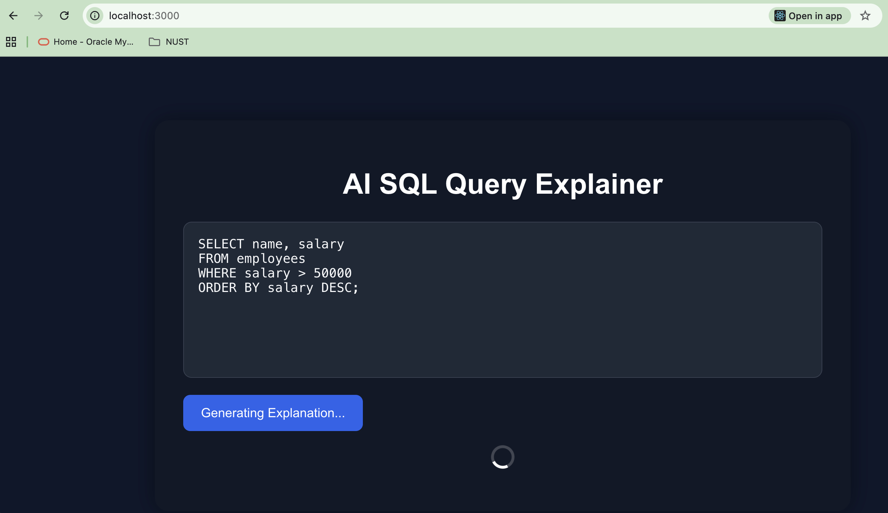

# AI SQL Query Explainer

My first AI-powered full-stack application built over the weekend using React, Flask, and Ollama.

## Features

- Paste SQL queries
- AI explains queries in simple English
- Local LLM integration using Ollama
- React frontend + Flask backend

---

## Tech Stack

- React
- Flask
- Python
- Ollama
- Llama 3 (Decided to drop because it was very heavy for my Macbook)
- Phi3 (Curently Using)

---

## What I Learned

This project helped me learn:

- Full-stack integration
- AI model integration
- Backend debugging
- Running local LLMs
- Real-world development workflow

---

## Project Screenshot

See my complete story at https://medium.com/@muhammadarslannawaz

---

## Future Improvements

- Better UI/UX
- Faster local models (Phi)
- Syntax highlighting
- Better explanations
- Loading spinner

---

## Why I Built This

I wanted to stop consuming tutorials endlessly and start building practical AI projects.

This was my first step toward learning AI development by actually building something real.